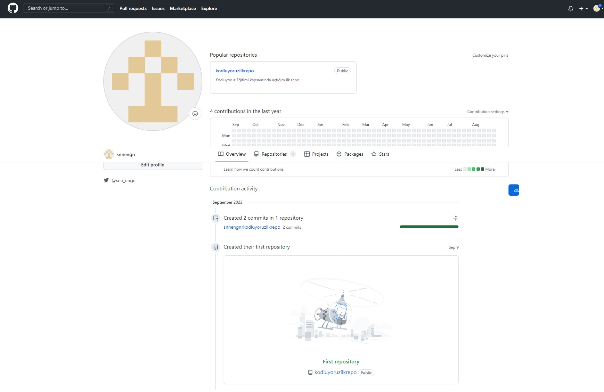

# Kodluyoruz İlk Repo 

Bu repo [Kodluyoruz](https://www.kodluyoruz.org) Front-End Eğitiminde oluşturduğumuz ilk repo. İçerisinde bir adet README dosyası, bir adet de index.html barındırıyor.
<<<<<<< HEAD

=======

>>>>>>> d74c6682b415576de240062e6b21478661210ff5

## Installation
Öncelikle projeyi clonelayın. (https://github.com/snnengn/kodluyoruzilkrepo.git)

```bash
git clone https://https://github.com/snnengn/kodluyoruzilkrepo.git
```

## Usage
Projeyi cloneladıktan sonra Visual Studio Code programında açınız.

Linux için:
```linux
cd kodluyoruzilkrepo
code
```

## Contributing

Pull requestler kabul edilir. Büyük değişiklikler için, lütfen önce neyi değiştirmek istediğinizi tartışmak için bir konu açınız.

## License
[MIT](https://choosealicense.com/licenses/mit/)

